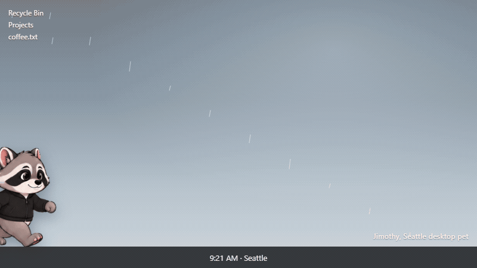

<p align="center">
  
</p>

<h1 align="center">Jimothy</h1>

<p align="center">
  <strong>Rainier Bandit.</strong> The Emerald City's friendliest taskbar trash panda.<br>
  Seattle desktop pet raccoon for Windows and macOS.
</p>

<p align="center">Windows tray · macOS menu bar · click-through · no accounts</p>

Jimothy is a free, open source desktop mascot and virtual pet. He lives on your taskbar. He breathes, sits, naps, talks, and wanders the bottom of the screen when you let him. Empty pixels fall through to the desktop. The pet window stays unfocused, so the app you were using keeps the keyboard. No dock icon.

Made with &lt;3 in Seattle.

## Features

- **Jacket or fur**, in small, medium, or large
- **Idle fidgets, roam, and nap**, plus a click that waves, cheers, or jumps
- **Speech bubbles**, a few surprises, and drag and drop
- **Tray and menu bar** for outfit, size, roam, pace, talk, pause, and nap
- **Settings** for look, movement, personality, and launch at login
- **Installers** for Windows (NSIS) and macOS (DMG), built on each platform

<p align="center">
  
</p>

## How he stays put

<p align="center">
  
</p>

You click him, or you use the menu bar. Both talk to the main process, which keeps the always-on-top window and his settings file. Closing the card leaves him running. The overlay reaches the main process only through the isolated `jimothy` bridge. From there he plays the 512 px strips, pins a paper scrap of speech over his head, and plants his feet on the taskbar.

The editable drawing is [`docs/diagrams/how-jimothy-stays.excalidraw`](docs/diagrams/how-jimothy-stays.excalidraw).

## Questions

### What is Jimothy?

A Seattle desktop pet raccoon. He sits on the taskbar instead of climbing other windows. This repository is Rainier Bandit.

### Is there a raccoon desktop pet for Windows?

Yes. `npm run dist:win` builds an NSIS installer. The tray icon controls outfit, size, roam, pace, talk, pause, nap, and quit.

### Is there a raccoon desktop pet for Mac?

Yes. On a Mac, `npm run dist:mac` builds a DMG and a zip. He lives in the menu bar, with no Dock icon. Signing is described under Package.

### Is this desktop pet free?

Yes. MIT license. The app has no accounts.

### Will the pet steal clicks or the keyboard?

No. Empty sprite pixels are click-through, and the pet window stays unfocused.

### Can the raccoon start at login?

Yes. Launch at login is in settings.

## Run

Jimothy is a TypeScript Electron app.

```bash
npm install
npm test
npm start
```

`npm run dev` is the same build with detached DevTools (`--dev`).

## Package

```bash
npm run dist:win    # NSIS installer, from Windows
npm run dist:mac    # DMG and zip, from macOS
```

macOS builds have to be made on a Mac. The packaged app is an agent (`LSUIElement`): menu bar only, no Dock icon. Packaging uses the Electron and electron-builder versions in `package.json`. The renderer is sandboxed, with context isolation on and Node integration off.

To sign and notarize a Mac build, set these before `npm run dist:mac`:

- `APPLE_ID`
- `APPLE_APP_SPECIFIC_PASSWORD`
- `APPLE_TEAM_ID`
- `CSC_LINK`, the Developer ID `.p12`
- `CSC_KEY_PASSWORD`

Without those, the DMG still builds. Gatekeeper blocks it until a Developer ID signs it.

## Layout

```
src/main/          Electron main process
src/preload/       Isolated bridge
src/renderer/      Pet overlay and settings
src/shared/        Types, settings, layout math
src/assets/sprites Jacketed and non-jacketed 512 px sheets
```

Live sheets are 512 by 512 pixel cells: idle, walk, run, wave, sit, sleep, jump, and celebrate. Walk and run play one gait cycle. `no_jacket/` is unused inventory.

## License

MIT. Jimothy does not ship game assets, CD keys, or anything that is not his own raccoon.
