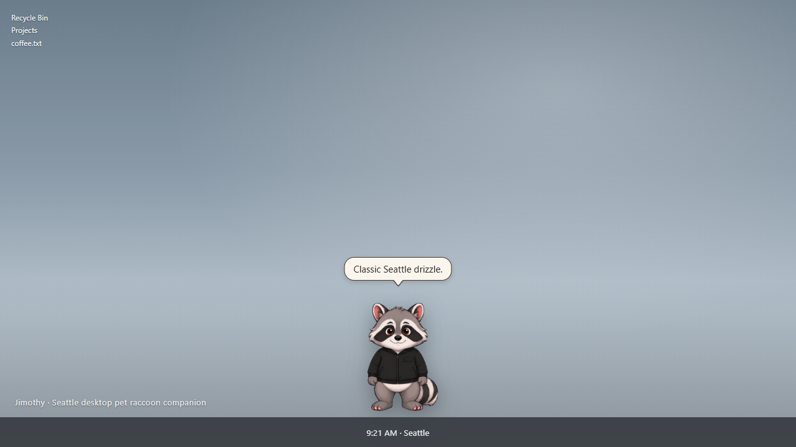
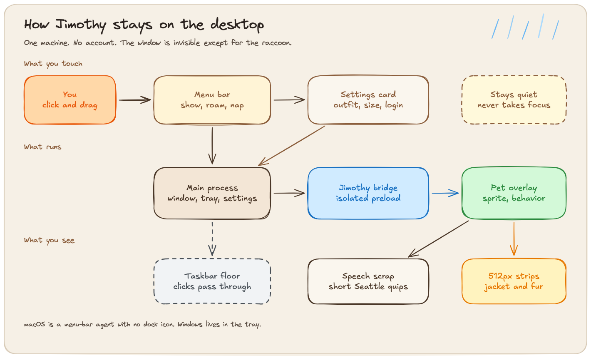
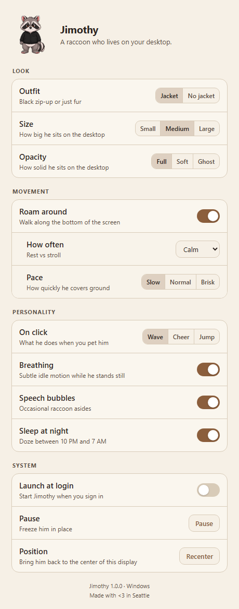

# Jimothy — Seattle Desktop Pet Raccoon Companion

**The Emerald City’s friendliest taskbar trash panda.**

Jimothy is a Seattle desktop pet and raccoon companion for **Windows** and **macOS**. He lives on your taskbar, breathes, sits, naps, talks, and (if you let him) wanders the bottom of the screen. No dock takeover. No accounts. Just a raccoon on the desktop.



Made with &lt;3 in Seattle.

## How he stays put



You click him, or you use the menu bar. The menu and the settings card both talk to the main process, which keeps the always-on-top window and his settings file. Closing the card leaves him running. The overlay can reach the main process only through the isolated `jimothy` bridge. From there he plays the 512px strips, pins a paper scrap of speech over his head, and plants his feet on the taskbar. Empty pixels let the click fall through to the desktop. The pet window stays unfocused, so the app you were using keeps the keyboard.

The editable drawing is [`docs/diagrams/how-jimothy-stays.excalidraw`](docs/diagrams/how-jimothy-stays.excalidraw).

## Features

- Desktop overlay raccoon (jacket or fur) with small / medium / large size
- Idle fidgets, roam, nap from the tray, click-to-pet (wave / cheer / jump)
- Speech bubbles, easter eggs, drag-and-drop, always-on-top click-through
- Native tray / menu-bar controls (outfit, size, roam, pace, talk, pause, nap)
- Settings for look, movement, personality, and launch-at-login
- Windows NSIS installer and macOS DMG (build on each platform)



## Develop

```bash
npm install
npm test
npm start
```

`npm run dev` is the same build with detached DevTools (`--dev`).

## Package

```bash
npm run dist:win    # NSIS installer, from Windows
npm run dist:mac    # DMG + zip, from macOS
```

macOS builds must be produced on a Mac. The packaged Mac app is an agent (`LSUIElement`): no dock icon, menu-bar tray only. Packaging uses Electron 39 and electron-builder 26. The renderer is sandboxed, with context isolation on and Node integration off.

To sign and notarize a Mac build, set these before `npm run dist:mac`:

```
APPLE_ID
APPLE_APP_SPECIFIC_PASSWORD
APPLE_TEAM_ID
CSC_LINK                 # Developer ID .p12
CSC_KEY_PASSWORD
```

Without those credentials the DMG still builds; Gatekeeper will block it until a Developer ID signs it.

## Layout

```
src/main/          Electron main process
src/preload/       Isolated bridge
src/renderer/      Pet overlay + settings UI
src/shared/        Types, settings, layout math
src/assets/sprites Live jacketed + non-jacketed 512px sheets
```

Live action sheets are 512×512 cells (idle, walk, run, wave, sit, sleep, jump, celebrate). Walk/run play one gait cycle. `no_jacket/` is unused inventory.

## License

MIT. Jimothy does not ship game assets, CD keys, or anything that is not his own raccoon.
